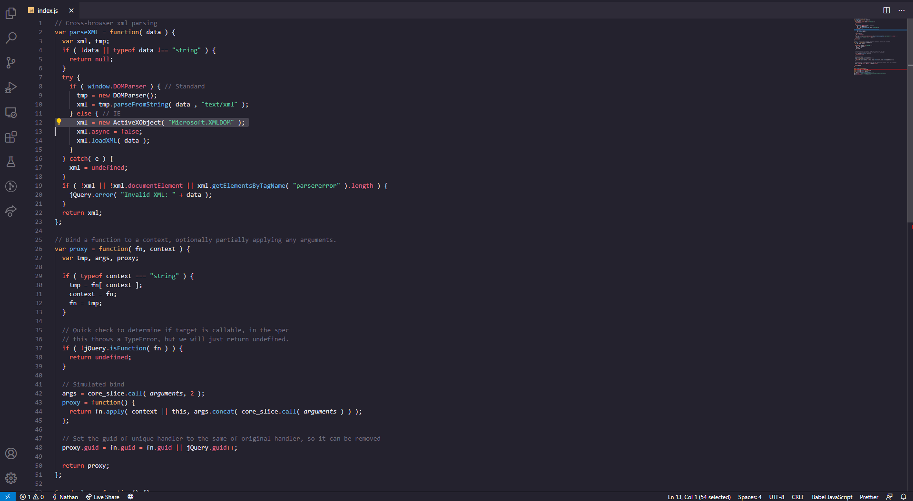

# 
 Grimoire Theme 

Grimoire is a light (WIP) & dark take on many themes with <b>vibrant colors</b> without sacrificing <b>readability</b>.

# Instalation
Grimoire can be found in the Visual Studio Code Extension Marketplace. Press Ctrl + Shift + X on Windows and Linux or ⇧ + ⌘ + X on Mac and then searching for "Grimoire".
  

# Credits
Inspired by [Noctis](https://github.com/liviuschera/noctis), [One Dark](https://github.com/atom/atom/tree/master/packages/one-dark-syntax), [Material Theme](https://github.com/material-theme/vsc-material-theme), [Monokai Pro](https://monokai.pro/), [Shades of Purple](https://github.com/ahmadawais/shades-of-purple-vscode), and several others.